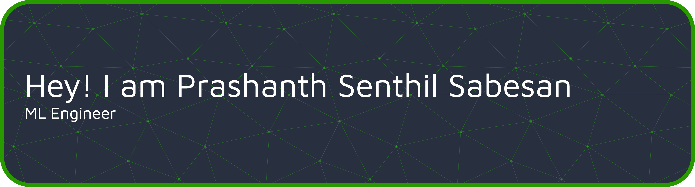

Hi there 👋

I’m Prashanth — a Software Engineer exploring the intersection of AI, systems design, and clean, impactful engineering.

<!--## 📝 Latest Blog Posts-->

 

<!-- BLOG-POST-LIST:START -->

<!-- BLOG-POST-LIST:END -->

 
<!--
## 📌 Pinned Repositories

 

 

 

 
 

## &#x1f4c8; GitHub Stats

 

-->
 
 

## 💼 Skills

More Skills

 

 

 

 

## 📣 How about a Breaking Bad quote before you go?

> Is that your fly-sabre?
>
> 
- Jesse Pinkman

_Quote requested from [Breaking Bad API](https://breakingbadquotes.xyz/)_

Check back at the top of the hour for a new quote!
