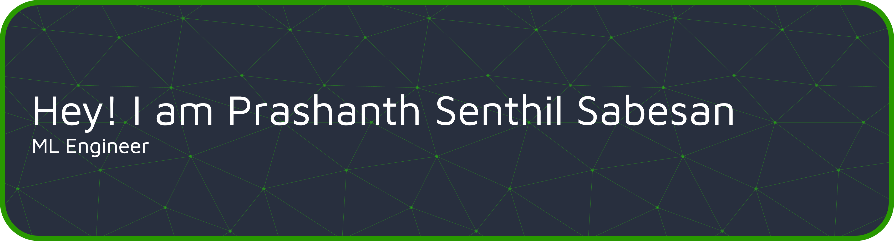

<!-- BLOG-POST-LIST:START -->

<!-- BLOG-POST-LIST:END -->

<!-- Pinned Repositories -- >

 

<!-- GitHub Stats -- >

...

More Skills

...

{bb_quote}

{bb_character}

Check back at the top of the hour for a new quote!
